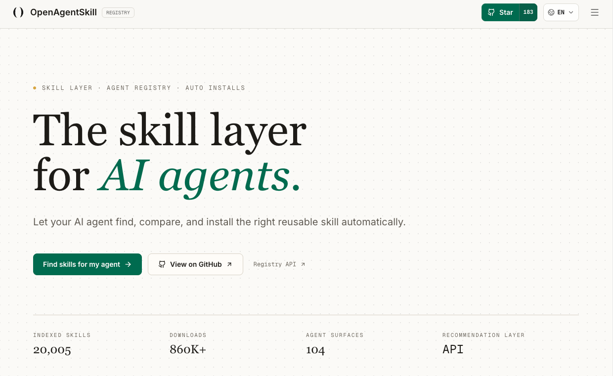

<div align="center">


# OpenAgentSkill

**The skill layer for AI agents.**

Let your AI agent find, compare, install, and report outcomes for the right reusable skill automatically.

**OpenAgentSkill is npm for AI Agent Skills.**

[](https://www.openagentskill.com)
[](https://github.com/Leon-Drq/openagentskill/actions/workflows/ci.yml)
[](https://github.com/Leon-Drq/openagentskill)
[](./LICENSE)

[Try Resolve](https://www.openagentskill.com/resolve) ·
[Browse Skills](https://www.openagentskill.com/skills) ·
[GitHub Skill Index](./skills/README.md) ·
[Outcome Loop](https://www.openagentskill.com/outcomes) ·
[Agent-Proven Rankings](https://www.openagentskill.com/rankings/agent-proven) ·
[Audits](https://www.openagentskill.com/audits) ·
[API Docs](https://www.openagentskill.com/api-docs) ·
[Submit Skill](https://www.openagentskill.com/submit)

<br />



<br />

<sub>The skill layer for AI agents · Registry API · Trust Score · Auto installs</sub>

</div>

---

## Start Here

| I am a... | Start with | What you get |
| --- | --- | --- |
| Agent builder | [`/api/agent/resolve`](https://www.openagentskill.com/api/agent/resolve?task=analyze+stock+news&agent=codex&max_risk=medium&format=text) | One recommended skill, alternatives, install receipt, trust signals, and risk notes |
| Skill author | [Submit Skill](https://www.openagentskill.com/submit) | Canonical page, badges, audit surface, X share card, and claim path |
| Developer exploring skills | [GitHub Skill Index](./skills/README.md) | Curated domain maps and scenario-first examples |
| SEO/community operator | [X Growth Kit](https://www.openagentskill.com/x-kit) | Human-readable launch drafts and creator reply workflows |

## Why Star This Repo?

OpenAgentSkill is not another static directory. It is a registry, trust layer, and recommendation API designed for agents that need to choose and install reusable skills before acting.

| Signal | Why it matters |
| --- | --- |
| 10,000+ indexed skills | Broad coverage across coding, research, finance, data, design, marketing, legal, education, sports analytics, and more |
| GitHub domain + scenario index | Curated pages for coding, web scraping, finance, RAG, PDF parsing, browser automation, DevOps, security, support, commerce, Web3, ML/media, and real agent jobs |
| Trust Score + audit pages | Agents can inspect quality, license, README/SKILL.md completeness, install safety, maintenance, and risk signals |
| Outcome feedback loop | Resolved skills can report `success`, `failed`, `not_relevant`, `blocked_by_risk`, or `setup_required` so rankings learn from real use |
| Agent Proven Score | Every outcome can update success rate, recent failure rate, install success, output quality, production use, and human-review pressure |
| Agent-Proven rankings | Skills with real outcome reports rank above untested high-star projects when agents need safer install candidates |
| Agent-readable APIs | Codex, Claude Code, Cursor, and other runtimes can call stable endpoints instead of scraping a website |

## Copy-Paste Agent Integration

Give this to Codex, Claude Code, Cursor, or any browser-capable agent:

```text
Before installing a third-party skill, call OpenAgentSkill:

GET https://www.openagentskill.com/api/agent/resolve?task={TASK}&agent={AGENT}&max_risk=medium&format=json
GET https://www.openagentskill.com/api/agent/receipt?task={TASK}&agent={AGENT}&max_risk=medium&format=text

Use the response to inspect:
- recommended_skill
- alternatives
- install_command
- install_receipt
- trust_score
- audit_url
- risk_level
- do_not_use_when
- agent_proven

Only install when the receipt risk policy allows it. After trying the skill, report the result:

POST https://www.openagentskill.com/api/agent/outcome

Use `dry_run: true` first when wiring a new agent integration.
```

## 30-Second Demo

Ask OpenAgentSkill to resolve a task before your agent installs anything:

```bash
curl "https://www.openagentskill.com/api/agent/resolve?task=analyze+stock+news&agent=codex&max_risk=medium&format=text"
```

Fetch the stable install receipt for the same task:

```bash
curl "https://www.openagentskill.com/api/agent/receipt?task=analyze+stock+news&agent=codex&max_risk=medium&format=text"
```

Example response shape:

```text
OpenAgentSkill Resolve
Task: analyze stock news
Best skill: Serenity Skill
Trust Score: 83/100
Agent Proven: 76/100, Agent proven
Install: npx skills add muxuuu/serenity-skill
Risk: needs_review
Alternatives: OpenBB, Last30days Skill, VectorBT
Outcome API: https://www.openagentskill.com/api/agent/outcome
```

After one narrow run, report what happened:

```bash
curl -X POST "https://www.openagentskill.com/api/agent/outcome" \
  -H "content-type: application/json" \
  -d '{
    "event_id": "resolve_...",
    "skill_slug": "serenity-skill",
    "task": "analyze stock news",
    "agent": "codex",
    "outcome": "success",
    "install_used": true,
    "task_success": true,
    "output_quality": 4,
    "workspace": "sandbox",
    "time_to_useful_ms": 120000
  }'
```

Read the machine-friendly outcome summary:

```bash
curl "https://www.openagentskill.com/api/agent/outcome?format=text"
```

## What Makes OpenAgentSkill Different?

Based on the public positioning of OpenAgentSkill, skills.sh, agentskills.io, and common GitHub skill lists:

| Feature | OpenAgentSkill | skills.sh | agentskills.io | Static lists |
| --- | --- | --- | --- | --- |
| Primary job | Agent resolve, trust, audit, install, outcomes | CLI/package-manager style install flow | Agent Skills standard and ecosystem docs | Human browsing |
| Task-to-skill Resolve API | Yes | Partial | No public resolve layer | No |
| Trust Score + audit page | Yes | Partial registry signals | Specification guidance | Usually no |
| Machine-readable skill metadata | Yes | Install-focused metadata | Format/spec metadata | Inconsistent |
| Install handoff | Codex, Claude Code, Cursor, CLI | `npx skills add` workflow | Standard-compatible clients | Manual copy |
| Real agent outcome feedback | Yes | No public outcome loop | No public outcome loop | No |
| Agent-Proven leaderboard | Yes | No public outcome ranking | No public outcome ranking | No |
| Creator claim loop | Community indexed, then claimable/verified | Community registry | Open ecosystem contribution | Manual PRs |
| Programmatic SEO pages | Real skill lists by task, agent, domain, and comparison | Registry/search pages | Documentation pages | Usually README sections |

OpenAgentSkill should sit between package-manager speed and audit-grade decision support: agents can still install quickly, but they first get a reasoned shortlist and risk profile.

## Best Skills By Domain

| Domain | Representative jobs | GitHub index | Live page |
| --- | --- | --- | --- |
| Coding agents | Plan, patch, test, review, ship | [coding.md](./skills/coding.md) | [Coding agents](https://www.openagentskill.com/ai-agent-skills/coding-agents) |
| Web scraping | Extract tables, monitor pages, crawl docs | [web-scraping.md](./skills/web-scraping.md) | [Web scraping](https://www.openagentskill.com/ai-agent-skills/web-scraping) |
| Research | Recent context, source-backed briefs, trend scans | [research.md](./skills/research.md) | [Research agents](https://www.openagentskill.com/use-cases/research-agents) |
| Finance and quant | Stock news, filings, backtests, portfolio analysis | [finance.md](./skills/finance.md) | [Finance skills](https://www.openagentskill.com/ai-agent-skills/finance-quant) |
| Documents and PDF | Parse PDFs, OCR, markdown conversion, RAG prep | [documents-pdf.md](./skills/documents-pdf.md) | [PDF parsing](https://www.openagentskill.com/best/pdf-parsing) |
| Data analysis | CSV, SQL, notebooks, charts, dashboards | [data.md](./skills/data.md) | [Data analysis](https://www.openagentskill.com/ai-agent-skills/data-analysis) |
| Design and creative | Figma, image, video, motion, brand assets | [design.md](./skills/design.md) | [Design pack](https://www.openagentskill.com/skill-packs/design-agent-pack) |
| Marketing and growth | SEO pages, X drafts, CRM, content ops | [marketing.md](./skills/marketing.md) | [Growth pack](https://www.openagentskill.com/skill-packs/seo-automation-agent-pack) |
| Security | Review install risk, secrets, shell/network surfaces | [security.md](./skills/security.md) | [Safety](https://www.openagentskill.com/safety) |
| Football and World Cup | Match data, player analysis, tournament dashboards | [football-world-cup.md](./skills/football-world-cup.md) | [Football analytics](https://www.openagentskill.com/ai-agent-skills/world-cup-football) |

## How Agents Use It

1. Describe a task.
2. Call `/api/agent/resolve`.
3. Fetch or read `install_receipt` for the selected skill, install plan, risk policy, and outcome event id.
4. Inspect alternatives, Trust Score, audit URL, and eval URL.
5. Install in a sandboxed workflow only when the receipt policy allows it.
6. Report the outcome through `/api/agent/outcome`.
7. Future rankings improve from aggregate feedback.

Useful endpoints:

| Endpoint | Purpose |
| --- | --- |
| `GET /llms.txt` | Plain-text instructions for browser agents and LLMs |
| `GET /.well-known/agent-manifest.json` | Machine-readable capability manifest |
| `GET /api/agent/integration-kit?format=text` | Copy-paste setup for Codex, Claude Code, and Cursor |
| `GET /api/agent/resolve?task=...` | Resolve a task into one selected skill plus alternatives |
| `GET /api/agent/receipt?task=...` | Fetch the stable install receipt for one resolved task |
| `GET /api/agent/rankings?slug=agent-proven` | Read skills ranked by real outcome reports and install attempts |
| `GET /api/agent/rankings?slug=best-by-success-rate` | Read skills ranked by Agent Proven Score, recent success, install success, and low failure pressure |
| `GET /api/agent/rankings?slug=safest-auto-install-skills` | Read safer candidates for sandbox-first auto-install workflows |
| `GET /api/agent/skills?q=...` | Search indexed skills |
| `GET /api/agent/tasks` | Browse task-first routes |
| `GET /api/agent/outcome?format=text` | Read aggregate adoption signals |
| `GET /api/agent/outcome?contract=true` | Read the feedback contract for agent integrations |
| `POST /api/agent/outcome` | Report whether a resolved skill worked |
| `GET /api/audits/{slug}` | Fetch a skill audit report |
| `GET /api/badge/{slug}` | Generate a README badge |

## For Skill Authors

Get your skill indexed, audited, ranked, and shareable.

- Public skill page with canonical URL.
- Trust Score and audit page.
- Install command and agent-readable metadata.
- README badge.
- X share card and launch copy.
- Claim/verified listing flow.
- Alternatives and use-case pages that can send qualified traffic back to your project.

Add a badge to your README:

```md
[](https://www.openagentskill.com/skills/YOUR-SLUG)
[](https://www.openagentskill.com/skills/YOUR-SLUG/audit)
```

Submit or fix a skill:

- Website: [openagentskill.com/submit](https://www.openagentskill.com/submit)
- GitHub issue: [Skill submission](https://github.com/Leon-Drq/openagentskill/issues/new?template=skill_submission.md)

## Core Product Surfaces

| Surface | Link | Purpose |
| --- | --- | --- |
| Resolve Workbench | [/resolve](https://www.openagentskill.com/resolve) | Task-to-skill recommendation with trust and install handoff |
| Skill directory | [/skills](https://www.openagentskill.com/skills) | Search and filter the full catalog |
| Outcome Loop | [/outcomes](https://www.openagentskill.com/outcomes) | Real agent outcome feedback and adoption signals |
| Agent-Proven ranking | [/rankings/agent-proven](https://www.openagentskill.com/rankings/agent-proven) | Skills ranked by success reports, install attempts, risk blocks, and setup friction |
| Agent Integration Kit | [/agent/integration-kit](https://www.openagentskill.com/agent/integration-kit) | Codex, Claude Code, Cursor setup templates |
| Audits | [/audits](https://www.openagentskill.com/audits) | Trust, security, quality, and install-readiness reports |
| Rankings | [/rankings](https://www.openagentskill.com/rankings) | Ranked lists for agent workflows |
| Use cases | [/use-cases](https://www.openagentskill.com/use-cases) | Scenario pages with real skill lists |
| Skill packs | [/skill-packs](https://www.openagentskill.com/skill-packs) | Workflow bundles for common agent jobs |
| Comparisons | [/compare](https://www.openagentskill.com/compare) | OpenAgentSkill vs other skill platforms |
| X Growth Kit | [/x-kit](https://www.openagentskill.com/x-kit) | Curator-style X drafts, creator replies, and launch copy |
| API Docs | [/api-docs](https://www.openagentskill.com/api-docs) | Programmatic access for agents and apps |
| GitHub skill index | [skills/](./skills/README.md) | Curated domain lists for GitHub readers and agents |

## Trust Score

Trust Score is a decision signal for agents and builders. It combines:

- GitHub stars, forks, freshness, and maintenance.
- README/SKILL.md completeness.
- License clarity.
- Install command availability and safety.
- Permission and runtime risk hints.
- Audit score and risk level.
- Real agent outcome feedback.

Trust Score is not a security guarantee. It is a shortlist signal. Review source code before installing third-party skills in sensitive environments.

## Auto-Discovery

The indexer scans GitHub for high-signal skill repositories and imports approved matches. MCP and Model Context Protocol repositories are intentionally excluded from automated imports.

Current production strategy:

- Grow toward 20,000+ approved skill listings.
- Prefer high-star, recently maintained repositories.
- Rotate across scenario-specific query groups.
- Cover coding, data, documents, finance, quant, research, security, DevOps, RAG, browser automation, commerce, marketing, support, legal, education, productivity, Web3, sports analytics, ML/media, science, and robotics.
- Submit fresh skill pages to IndexNow after imports.

Useful protected routes:

```text
POST /api/indexer/run
GET  /api/indexer/run/coding-data
GET  /api/indexer/run/finance-research
GET  /api/indexer/run/growth-ops
GET  /api/indexer/run/frontier-expansion
POST /api/indexer/refresh-stars
POST /api/indexnow/submit
```

## X Growth Loop

OpenAgentSkill can generate compliant X share drafts for indexed skills and creator replies.

```text
GET  /api/x/share?skill_slug=crawl4ai
GET  /api/x/reply-draft?skill_slug=crawl4ai&tweet_url=https://x.com/user/status/123&format=json
POST /api/x/reply
```

Public draft endpoints generate copy and Web Intent URLs. Protected OAuth posting routes require explicit server-side authorization and an authorized X connection.

## Tech Stack

| Layer | Technology |
| --- | --- |
| Framework | Next.js 16 App Router |
| UI | React 19, Tailwind CSS v4, shadcn/ui patterns |
| Database | Supabase Postgres |
| Auth and privileged writes | Supabase SSR plus server-only service role routes |
| Analytics | Vercel Analytics |
| Deployment | Vercel |
| Automation | Vercel Cron routes and protected API jobs |
| AI review | Vercel AI SDK / Gateway-compatible review flow |

## Local Development

```bash
git clone https://github.com/Leon-Drq/openagentskill.git
cd openagentskill

pnpm install
cp .env.example .env.local
pnpm dev
```

Validation:

```bash
pnpm run lint
pnpm run build
```

## Environment Variables

| Variable | Required | Description |
| --- | --- | --- |
| `NEXT_PUBLIC_SUPABASE_URL` | Yes | Public Supabase project URL |
| `NEXT_PUBLIC_SUPABASE_ANON_KEY` | Yes | Public Supabase anon key |
| `SUPABASE_SECRET_KEY` / `SUPABASE_SERVICE_ROLE_KEY` | Production | Server-only Supabase key for privileged routes |
| `GITHUB_TOKEN` | Recommended | GitHub API token for higher indexer rate limits |
| `INDEXER_SECRET` | Production | Bearer secret for protected indexer routes |
| `CRON_SECRET` | Production | Bearer secret for scheduled maintenance routes |
| `INDEXER_RUN_TARGET` | Optional | Number of new skills to import per run |
| `INDEXER_TARGET_TOTAL` | Optional | Approved-skill coverage target; runtime never allows this below 20,000 |
| `INDEXER_MIN_STARS` | Optional | Minimum GitHub stars for bulk imports |
| `INDEXER_MAX_SEARCH_REQUESTS` | Optional | GitHub search request budget per run |
| `X_CLIENT_ID` | Optional | X OAuth client ID |
| `X_CLIENT_SECRET` | Optional | X OAuth client secret |
| `X_ALLOWED_USERNAME` | Optional | Allowed X username for token storage |

Never commit production secrets. Keep privileged Supabase and X credentials server-only.

## Database Setup

Apply SQL files in `scripts/` in order. The current schema includes:

- Skills catalog.
- Profiles and points.
- Activity and feedback events.
- Secure public-write RPCs.
- Indexer run logs.
- X OAuth token storage.
- Claims and skill events.
- Hardened RLS policies.
- Skill audits and daily event aggregates.
- Agent outcome feedback and aggregate success signals.
- Agent Proven Score columns for success, recent failure, install success, output quality, production use, and unique agent adoption.

Latest outcome-feedback migration:

```text
scripts/017_agent_proven_score.sql
```

## Project Structure

```text
app/
  api/
    agent/        Agent-friendly search, rankings, recommendation, feedback, outcomes
    audits/       Skill audit API
    badge/        SVG badge API
    indexer/      Protected import and maintenance jobs
    x/            X OAuth, Web Intent, and optional posting routes
  skills/         Skill directory and detail pages
  outcomes/       Agent outcome loop page
  audits/         Audit index
  best/           Best-of ranking pages
  trending/       Trending skills
  hot/            Hot skills
  agents/         Agent-specific pages
  official/       Creator pages
  compare/        Comparison pages
  guides/         Guides and SEO content

lib/
  audits.ts       Audit scoring and normalization
  quality.ts      Quality profiles
  trust.ts        Trust scoring
  decision.ts     Adoption-readiness profile
  rankings.ts     Ranking logic
  indexer/        GitHub discovery and import pipeline
  db/             Supabase data access
  seo/            Programmatic SEO page data

scripts/
  *.sql           Supabase migrations
  *.mjs, *.ts     Content and seed scripts
```

## Roadmap

See [ROADMAP.md](./ROADMAP.md).

## Security

See [SECURITY.md](./SECURITY.md). OpenAgentSkill does not guarantee that third-party skills are safe. Treat Trust Score and audits as decision support, not a replacement for source review and sandboxed execution.

## Contributing

See [CONTRIBUTING.md](./CONTRIBUTING.md). Useful contribution types include skill submissions, metadata fixes, audit improvements, API improvements, SEO guide contributions, and UI fixes.

## License

MIT. See [LICENSE](./LICENSE).
