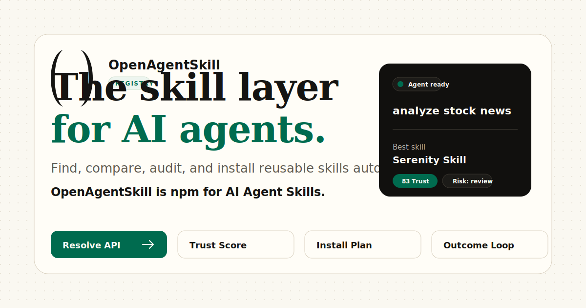

<div align="center">


# OpenAgentSkill

**The skill layer for AI agents.**

Let your AI agent find, compare, install, and report outcomes for the right reusable skill automatically.

**OpenAgentSkill is npm for AI Agent Skills.**

[](https://www.openagentskill.com)
[](https://github.com/Leon-Drq/openagentskill/actions/workflows/ci.yml)
[](https://github.com/Leon-Drq/openagentskill)
[](./LICENSE)

[Try Resolve](https://www.openagentskill.com/resolve) ·
[Browse Skills](https://www.openagentskill.com/skills) ·
[Outcome Loop](https://www.openagentskill.com/outcomes) ·
[Audits](https://www.openagentskill.com/audits) ·
[API Docs](https://www.openagentskill.com/api-docs) ·
[Submit Skill](https://www.openagentskill.com/submit)

<br />



</div>

---

## Why Star This Repo?

OpenAgentSkill is not another static directory. It is a registry, trust layer, and recommendation API designed for agents that need to choose and install reusable skills before acting.

| Signal | Why it matters |
| --- | --- |
| 10,000+ indexed skills | Broad coverage across coding, research, finance, data, design, marketing, legal, education, sports analytics, and more |
| Trust Score + audit pages | Agents can inspect quality, license, README/SKILL.md completeness, install safety, maintenance, and risk signals |
| Outcome feedback loop | Resolved skills can report `success`, `failed`, `not_relevant`, `blocked_by_risk`, or `setup_required` so rankings learn from real use |
| Agent-readable APIs | Codex, Claude Code, Cursor, and other runtimes can call stable endpoints instead of scraping a website |

## 30-Second Demo

Ask OpenAgentSkill to resolve a task before your agent installs anything:

```bash
curl "https://www.openagentskill.com/api/agent/resolve?task=analyze+stock+news&agent=codex&max_risk=medium&format=text"
```

Example response shape:

```text
OpenAgentSkill Resolve
Task: analyze stock news
Best skill: Serenity Skill
Trust Score: 83/100
Install: npx skills add muxuuu/serenity-skill
Risk: needs_review
Alternatives: OpenBB, Last30days Skill, VectorBT
Outcome API: https://www.openagentskill.com/api/agent/outcome
```

After one narrow run, report what happened:

```bash
curl -X POST "https://www.openagentskill.com/api/agent/outcome" \
  -H "content-type: application/json" \
  -d '{
    "event_id": "resolve_...",
    "skill_slug": "serenity-skill",
    "task": "analyze stock news",
    "agent": "codex",
    "outcome": "success",
    "install_used": true
  }'
```

Read the machine-friendly outcome summary:

```bash
curl "https://www.openagentskill.com/api/agent/outcome?format=text"
```

## What Makes OpenAgentSkill Different?

| Feature | OpenAgentSkill | Static directories |
| --- | --- | --- |
| Task-to-skill Resolve API | Yes | No |
| Trust Score | GitHub quality + audit + install safety + outcome evidence | Usually stars or manual labels |
| Public audit page | Yes | Usually no |
| Machine-readable skill metadata | Yes | Partial |
| Install handoff | Codex, Claude Code, Cursor, CLI | Partial |
| Real agent outcome feedback | Yes | No |
| Creator claim loop | Community indexed, then claimable/verified | Usually manual only |
| SEO/use-case pages with real skill lists | Yes | Often generic landing pages |

## How Agents Use It

1. Describe a task.
2. Call `/api/agent/resolve`.
3. Inspect the recommended skill, alternatives, Trust Score, audit URL, install plan, and risk policy.
4. Install in a sandboxed workflow only when the policy allows it.
5. Report the outcome through `/api/agent/outcome`.
6. Future rankings improve from aggregate feedback.

Useful endpoints:

| Endpoint | Purpose |
| --- | --- |
| `GET /llms.txt` | Plain-text instructions for browser agents and LLMs |
| `GET /.well-known/agent-manifest.json` | Machine-readable capability manifest |
| `GET /api/agent/integration-kit?format=text` | Copy-paste setup for Codex, Claude Code, and Cursor |
| `GET /api/agent/resolve?task=...` | Resolve a task into one selected skill plus alternatives |
| `GET /api/agent/skills?q=...` | Search indexed skills |
| `GET /api/agent/tasks` | Browse task-first routes |
| `GET /api/agent/outcome?format=text` | Read aggregate adoption signals |
| `POST /api/agent/outcome` | Report whether a resolved skill worked |
| `GET /api/audits/{slug}` | Fetch a skill audit report |
| `GET /api/badge/{slug}` | Generate a README badge |

## For Skill Authors

Get your skill indexed, audited, ranked, and shareable.

- Public skill page with canonical URL.
- Trust Score and audit page.
- Install command and agent-readable metadata.
- README badge.
- X share card and launch copy.
- Claim/verified listing flow.
- Alternatives and use-case pages that can send qualified traffic back to your project.

Add a badge to your README:

```md
[](https://www.openagentskill.com/skills/YOUR-SLUG)
[](https://www.openagentskill.com/skills/YOUR-SLUG/audit)
```

Submit or fix a skill:

- Website: [openagentskill.com/submit](https://www.openagentskill.com/submit)
- GitHub issue: [Skill submission](https://github.com/Leon-Drq/openagentskill/issues/new?template=skill_submission.md)

## Core Product Surfaces

| Surface | Link | Purpose |
| --- | --- | --- |
| Resolve Workbench | [/resolve](https://www.openagentskill.com/resolve) | Task-to-skill recommendation with trust and install handoff |
| Skill directory | [/skills](https://www.openagentskill.com/skills) | Search and filter the full catalog |
| Outcome Loop | [/outcomes](https://www.openagentskill.com/outcomes) | Real agent outcome feedback and adoption signals |
| Agent Integration Kit | [/agent/integration-kit](https://www.openagentskill.com/agent/integration-kit) | Codex, Claude Code, Cursor setup templates |
| Audits | [/audits](https://www.openagentskill.com/audits) | Trust, security, quality, and install-readiness reports |
| Rankings | [/rankings](https://www.openagentskill.com/rankings) | Ranked lists for agent workflows |
| Use cases | [/use-cases](https://www.openagentskill.com/use-cases) | Scenario pages with real skill lists |
| Skill packs | [/skill-packs](https://www.openagentskill.com/skill-packs) | Workflow bundles for common agent jobs |
| Comparisons | [/compare](https://www.openagentskill.com/compare) | OpenAgentSkill vs other skill platforms |
| API Docs | [/api-docs](https://www.openagentskill.com/api-docs) | Programmatic access for agents and apps |

## Trust Score

Trust Score is a decision signal for agents and builders. It combines:

- GitHub stars, forks, freshness, and maintenance.
- README/SKILL.md completeness.
- License clarity.
- Install command availability and safety.
- Permission and runtime risk hints.
- Audit score and risk level.
- Real agent outcome feedback.

Trust Score is not a security guarantee. It is a shortlist signal. Review source code before installing third-party skills in sensitive environments.

## Auto-Discovery

The indexer scans GitHub for high-signal skill repositories and imports approved matches. MCP and Model Context Protocol repositories are intentionally excluded from automated imports.

Current production strategy:

- Grow toward 20,000+ approved skill listings.
- Prefer high-star, recently maintained repositories.
- Rotate across scenario-specific query groups.
- Cover coding, data, documents, finance, quant, research, security, DevOps, RAG, browser automation, commerce, marketing, support, legal, education, productivity, Web3, sports analytics, ML/media, science, and robotics.
- Submit fresh skill pages to IndexNow after imports.

Useful protected routes:

```text
POST /api/indexer/run
GET  /api/indexer/run/coding-data
GET  /api/indexer/run/finance-research
GET  /api/indexer/run/growth-ops
GET  /api/indexer/run/frontier-expansion
POST /api/indexer/refresh-stars
POST /api/indexnow/submit
```

## X Growth Loop

OpenAgentSkill can generate compliant X share drafts for indexed skills and creator replies.

```text
GET  /api/x/share?skill_slug=crawl4ai
GET  /api/x/reply-draft?skill_slug=crawl4ai&tweet_url=https://x.com/user/status/123&format=json
POST /api/x/reply
```

Public draft endpoints generate copy and Web Intent URLs. Protected OAuth posting routes require explicit server-side authorization and an authorized X connection.

## Tech Stack

| Layer | Technology |
| --- | --- |
| Framework | Next.js 16 App Router |
| UI | React 19, Tailwind CSS v4, shadcn/ui patterns |
| Database | Supabase Postgres |
| Auth and privileged writes | Supabase SSR plus server-only service role routes |
| Analytics | Vercel Analytics |
| Deployment | Vercel |
| Automation | Vercel Cron routes and protected API jobs |
| AI review | Vercel AI SDK / Gateway-compatible review flow |

## Local Development

```bash
git clone https://github.com/Leon-Drq/openagentskill.git
cd openagentskill

pnpm install
cp .env.example .env.local
pnpm dev
```

Validation:

```bash
pnpm run lint
pnpm run build
```

## Environment Variables

| Variable | Required | Description |
| --- | --- | --- |
| `NEXT_PUBLIC_SUPABASE_URL` | Yes | Public Supabase project URL |
| `NEXT_PUBLIC_SUPABASE_ANON_KEY` | Yes | Public Supabase anon key |
| `SUPABASE_SECRET_KEY` / `SUPABASE_SERVICE_ROLE_KEY` | Production | Server-only Supabase key for privileged routes |
| `GITHUB_TOKEN` | Recommended | GitHub API token for higher indexer rate limits |
| `INDEXER_SECRET` | Production | Bearer secret for protected indexer routes |
| `CRON_SECRET` | Production | Bearer secret for scheduled maintenance routes |
| `INDEXER_RUN_TARGET` | Optional | Number of new skills to import per run |
| `INDEXER_TARGET_TOTAL` | Optional | Approved-skill coverage target; runtime never allows this below 20,000 |
| `INDEXER_MIN_STARS` | Optional | Minimum GitHub stars for bulk imports |
| `INDEXER_MAX_SEARCH_REQUESTS` | Optional | GitHub search request budget per run |
| `X_CLIENT_ID` | Optional | X OAuth client ID |
| `X_CLIENT_SECRET` | Optional | X OAuth client secret |
| `X_ALLOWED_USERNAME` | Optional | Allowed X username for token storage |

Never commit production secrets. Keep privileged Supabase and X credentials server-only.

## Database Setup

Apply SQL files in `scripts/` in order. The current schema includes:

- Skills catalog.
- Profiles and points.
- Activity and feedback events.
- Secure public-write RPCs.
- Indexer run logs.
- X OAuth token storage.
- Claims and skill events.
- Hardened RLS policies.
- Skill audits and daily event aggregates.
- Agent outcome feedback and aggregate success signals.

Latest outcome-feedback migration:

```text
scripts/015_agent_outcomes_and_resolve_evals.sql
```

## Project Structure

```text
app/
  api/
    agent/        Agent-friendly search, rankings, recommendation, feedback, outcomes
    audits/       Skill audit API
    badge/        SVG badge API
    indexer/      Protected import and maintenance jobs
    x/            X OAuth, Web Intent, and optional posting routes
  skills/         Skill directory and detail pages
  outcomes/       Agent outcome loop page
  audits/         Audit index
  best/           Best-of ranking pages
  trending/       Trending skills
  hot/            Hot skills
  agents/         Agent-specific pages
  official/       Creator pages
  compare/        Comparison pages
  guides/         Guides and SEO content

lib/
  audits.ts       Audit scoring and normalization
  quality.ts      Quality profiles
  trust.ts        Trust scoring
  decision.ts     Adoption-readiness profile
  rankings.ts     Ranking logic
  indexer/        GitHub discovery and import pipeline
  db/             Supabase data access
  seo/            Programmatic SEO page data

scripts/
  *.sql           Supabase migrations
  *.mjs, *.ts     Content and seed scripts
```

## Roadmap

See [ROADMAP.md](./ROADMAP.md).

## Security

See [SECURITY.md](./SECURITY.md). OpenAgentSkill does not guarantee that third-party skills are safe. Treat Trust Score and audits as decision support, not a replacement for source review and sandboxed execution.

## Contributing

See [CONTRIBUTING.md](./CONTRIBUTING.md). Useful contribution types include skill submissions, metadata fixes, audit improvements, API improvements, SEO guide contributions, and UI fixes.

## License

MIT. See [LICENSE](./LICENSE).
