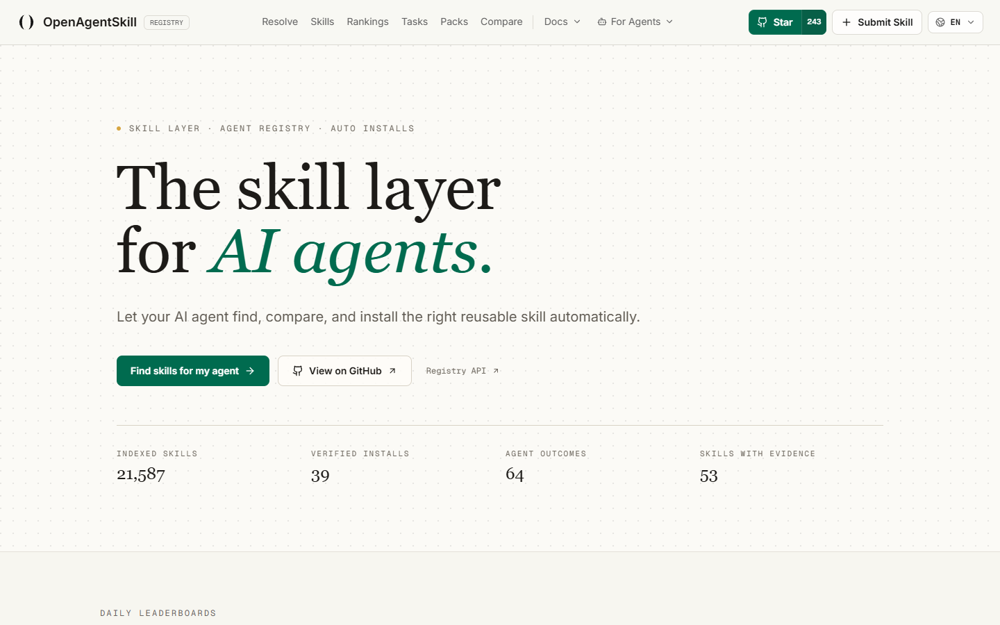
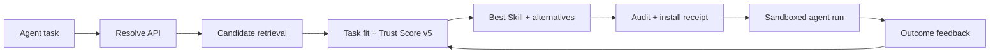

<div align="center">


# OpenAgentSkill

**The skill layer for AI agents.**

Find, compare, audit, and install the right reusable Agent Skill before an agent acts.

[](https://github.com/Leon-Drq/openagentskill/actions/workflows/ci.yml)
[](https://github.com/Leon-Drq/openagentskill/releases)
[](https://github.com/Leon-Drq/openagentskill/stargazers)
[](./LICENSE)

[**Try Resolve →**](https://www.openagentskill.com/resolve) · [**Install the CLI →**](#install-the-cli)

<br />



</div>

## Why OpenAgentSkill?

Agent Skills are easy to publish and increasingly hard to evaluate. A repository can be popular, recently updated, or well documented without being the right choice for a specific agent task.

OpenAgentSkill adds the decision layer between discovery and execution:

| Capability | What an agent gets |
| --- | --- |
| Task-to-skill resolve | One recommended Skill plus relevant alternatives |
| Trust and audit signals | License, maintenance, install safety, permission, and quality context |
| Install receipt | A stable, target-specific handoff for Codex, Claude Code, Cursor, or CLI |
| Outcome loop | Evidence from successful, failed, blocked, or setup-required agent runs |
| Machine-readable surfaces | JSON, text, OpenAPI, manifests, rankings, and public research datasets |

OpenAgentSkill is not a static list and does not claim third-party code is safe. It helps agents make a better, inspectable decision before installation.

## 30-second demo

Resolve a real task:

```bash
curl "https://www.openagentskill.com/api/agent/resolve?task=extract+tables+from+PDF+reports&agent=codex&max_risk=medium&format=text"
```

Example response:

```text
OpenAgentSkill Resolve
Task: extract tables from PDF reports
Best skill: <recommended skill>
Trust Score v5: <score and decision>
Install: <reviewed install command>
Risk: <risk level>
Alternatives: <ranked alternatives>
Receipt: <stable install handoff>
```

The same resolver is available as [JSON](https://www.openagentskill.com/api/agent/resolve?task=extract+tables+from+PDF+reports&agent=codex&max_risk=medium), [plain text](https://www.openagentskill.com/api/agent/resolve?task=extract+tables+from+PDF+reports&agent=codex&max_risk=medium&format=text), and a compact lockfile format.

## Install the CLI

Run the pinned, dependency-free GitHub Release:

```bash
npx --yes https://github.com/Leon-Drq/openagentskill/releases/download/cli-v0.2.1/openagentskill-0.2.1.tgz resolve "extract tables from PDF reports" --agent codex
```

Useful commands:

```bash
# Search without installing
npx --yes https://github.com/Leon-Drq/openagentskill/releases/download/cli-v0.2.1/openagentskill-0.2.1.tgz search "browser automation"

# Inspect a reviewed install plan
npx --yes https://github.com/Leon-Drq/openagentskill/releases/download/cli-v0.2.1/openagentskill-0.2.1.tgz install <skill-slug> --agent codex --dry-run

# Read the outcome reporting contract
npx --yes https://github.com/Leon-Drq/openagentskill/releases/download/cli-v0.2.1/openagentskill-0.2.1.tgz outcome-contract
```

The CLI refuses blocked Skills, requires explicit confirmation before execution, and supports `--no-telemetry`. Source and usage details live in [`packages/cli`](./packages/cli/README.md).

## Give this to an agent

```text
Before installing a third-party Skill, call:

GET https://www.openagentskill.com/api/agent/resolve
  ?task={TASK}
  &agent={AGENT}
  &max_risk=medium
  &format=json

Inspect the recommended skill, alternatives, Trust Score v5, audit URL,
risk level, install command, and install receipt. Use a sandbox first.

After one narrow run, report the outcome to:
POST https://www.openagentskill.com/api/agent/outcome
```

Copy-ready templates for Codex, Claude Code, and Cursor are available in the [Agent Integration Kit](https://www.openagentskill.com/agent/integration-kit).

## How it works


```mermaid
flowchart LR
    A["Agent task"] --> B["Resolve API"]
    B --> C["Candidate retrieval"]
    C --> D["Task fit + Trust Score v5"]
    D --> E["Best Skill + alternatives"]
    E --> F["Audit + install receipt"]
    F --> G["Sandboxed agent run"]
    G --> H["Outcome feedback"]
    H --> D
```

Ranking combines task relevance with repository evidence, install readiness, maintenance, license clarity, risk signals, and real agent outcomes. See [Resolve Evals](https://www.openagentskill.com/evals/resolve) for the public evaluation surface.

## Core interfaces

| Interface | Purpose |
| --- | --- |
| [Resolve Workbench](https://www.openagentskill.com/resolve) | Turn a task into a recommended Skill and install plan |
| [Skill Registry](https://www.openagentskill.com/skills) | Search and filter indexed Skills |
| [Rankings](https://www.openagentskill.com/rankings) | Compare trending, trusted, and Agent-Proven Skills |
| [Audit Index](https://www.openagentskill.com/audits) | Inspect install, maintenance, license, and risk evidence |
| [Skill Packs](https://www.openagentskill.com/skill-packs) | Compose reviewed Skills into reusable workflows |
| [Creator Kit](https://www.openagentskill.com/creator-kit) | Submit, claim, badge, and share a Skill |
| [API Docs](https://www.openagentskill.com/api-docs) | Integrate registry and agent endpoints |

Machine-readable entry points:

- [`llms.txt`](https://www.openagentskill.com/llms.txt)
- [Agent manifest](https://www.openagentskill.com/.well-known/agent-manifest.json)
- [OpenAgentSkill identity](https://www.openagentskill.com/.well-known/openagentskill.json)
- [OpenAPI document](https://www.openagentskill.com/openapi.json)
- [State of Agent Skills dataset](https://www.openagentskill.com/reports/state-of-agent-skills-2026.json)

## TypeScript SDK

The dependency-free SDK source lives in [`packages/sdk`](./packages/sdk/README.md):

```ts
import { OpenAgentSkill } from './packages/sdk/openagentskill.mjs'

const client = new OpenAgentSkill({
  baseUrl: 'https://www.openagentskill.com',
})

const plan = await client.resolve('audit a repository', {
  agent: 'codex',
  maxRisk: 'medium',
})

await client.reportOutcome({
  event_id: plan.feedback.event_id,
  skill_slug: plan.recommendation.best_skill.slug,
  task: plan.task,
  outcome: 'success',
  dry_run: true,
})
```

The SDK package is prepared for npm publication but is not presented here as published until the public registry release is verifiable.

## For Skill authors

Paste a repository, subdirectory, or `SKILL.md` URL into [Submit Skill](https://www.openagentskill.com/submit). Submissions are saved first and reviewed asynchronously; GitHub stars, a predefined category, and perfect metadata are not required.

After indexing, authors receive:

- A canonical Skill page and machine-readable metadata.
- Trust, audit, quality, and Agent-Proven badge endpoints.
- Claim and verified-maintainer paths.
- Alternatives and use-case pages that can send qualified traffic back to the source.

Browse the curated [GitHub Skill Index](./skills/README.md) for domain and scenario maps.

## Trust and security

OpenAgentSkill never treats popularity as proof of safety. Trust Score and audits are decision-support signals, not certifications or guarantees.

Before executing third-party code:

1. Read the source and install scripts.
2. Review permissions, network calls, dependencies, and required secrets.
3. Start in a sandbox or low-risk workspace.
4. Keep production credentials and customer data out of unreviewed Skills.

Report vulnerabilities privately through the repository's **Security** tab. Report risky or misleading third-party listings through the [Skill data issue form](https://github.com/Leon-Drq/openagentskill/issues/new/choose). See [SECURITY.md](./SECURITY.md) for scope and disclosure rules.

## Local development

Requirements: Node.js 22 and pnpm 10.28.2.

```bash
git clone https://github.com/Leon-Drq/openagentskill.git
cd openagentskill
corepack enable
pnpm install
cp .env.example .env.local
pnpm dev
```

Quality checks:

```bash
pnpm run lint
pnpm run typecheck
pnpm test
pnpm run build
```

The public website requires Supabase configuration. Pure parsing, resolver-contract, SDK, CLI, and circuit-breaker regression tests run without production credentials.

## Repository map

```text
app/          Next.js pages, APIs, manifests, reports, and agent surfaces
components/   Product UI and client interactions
lib/          Resolve, ranking, audit, indexer, database, and growth logic
packages/     Publishable CLI and SDK packages
scripts/      Regression tests, migrations, importers, and maintenance jobs
skills/       Curated GitHub Skill index by domain and scenario
supabase/     Database functions and migrations
```

## Contributing

Contributions are welcome across product, APIs, indexing, trust, documentation, and Skill metadata.

- Read [CONTRIBUTING.md](./CONTRIBUTING.md).
- Look for [`good first issue`](https://github.com/Leon-Drq/openagentskill/labels/good%20first%20issue) or [`help wanted`](https://github.com/Leon-Drq/openagentskill/labels/help%20wanted).
- Ask usage questions in [GitHub Discussions](https://github.com/Leon-Drq/openagentskill/discussions).
- Use [SUPPORT.md](./SUPPORT.md) to choose the right support channel.

Project decisions and maintainer responsibilities are documented in [GOVERNANCE.md](./GOVERNANCE.md). Releases are tracked in [CHANGELOG.md](./CHANGELOG.md), and planned work lives in [ROADMAP.md](./ROADMAP.md).

The two-layer discovery, validation, deduplication, fast-track, and GitHub rate-safety design is documented in [docs/candidate-intake-pipeline.md](./docs/candidate-intake-pipeline.md).

## License

[MIT](./LICENSE) © OpenAgentSkill contributors.
