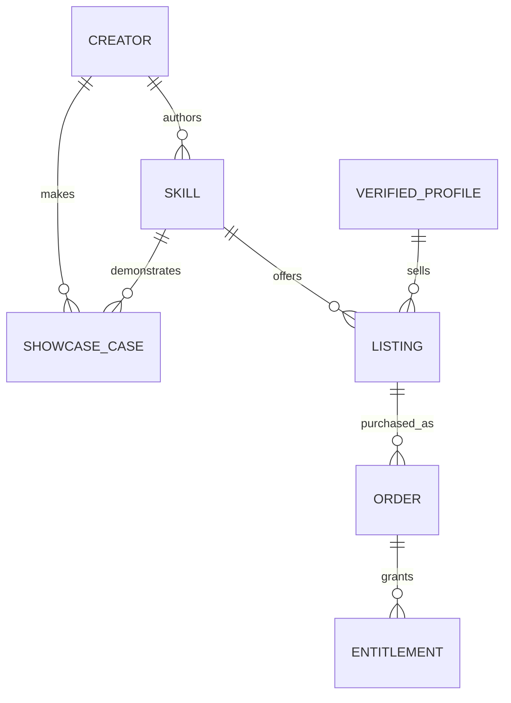

# Skill Gallery：内容维护与扩展

当前精选内容：100 个案例，覆盖 14 个技能或工作流；网页与界面 15 个、
演示文稿 30 个、图像 33 个、视频 20 个、文档 2 个。
其中 29 个作品案例（含 1 个本站制作案例）、40 个作者模板、31 个作者风格示例。
这些是 100 个精选展示条目，不代表 100 个独立技能，也不代表本站复测了 100 次。

## 产品入口

- `/showcase`：Skill Gallery，分类、作者筛选、搜索与案例列表；`?lang=zh` 为中文。
- `/showcase/[slug]`：成品、任务、条件、来源和使用指引。
- 首页主视觉之后：三个精选作品，连接完整作品页。
- 桌面导航、手机菜单、页脚：作品展示入口。
- mono-color、Taste Skill、Vox Director、Guizang PPT Skill、Open Design
  的现有技能详情页：关联案例模块。

沿用主页的暖白 `#fbfaf6`、墨绿 `#006b4f`、文字 `#1d1b18`、
分隔线 `#e4e0d8`，使用现有衬线标题、等宽眉题与简洁卡片。

## 选品依据和证据边界

首批从此前查询的近 30 天 `install_copy` 热门技能中挑选有作品证据的项目。
这是复制安装入口的行为信号，不能称为实际使用人数或成功安装数。
公开页面不展示过期统计，也不把作者作品标成平台复测成功。

- `provenance=author`：仓库作者发布的案例；注明原始来源与版本。
- `provenance=platform`：本站实际制作；保存实际提示词、日期与制作记录。
- `promptKind=original`：实际运行使用的完整原文。
- `promptKind=suggested`：平台按作品整理的尝试任务，明确说明不是原始提示词。
- `evidenceKind=template/style-study`：分别标为作者模板、作者风格示例，不冒充真实客户交付。
- 同一作品的多个页面、响应式视图不重复计数；同一设计任务只选一套代表版本。
- 模型、运行成本和耗时不详时明确说明，避免从视频时长推算制作耗时。
- Guizang 的交付标为 HTML 演示文稿，不能暗示原生可编辑 PPTX。
- Open Design 标为应用工作流，不能暗示它是无需配置的独立技能。

素材来源、原始文件映射、版权声明和许可见
[`public/showcase/ATTRIBUTION.md`](../public/showcase/ATTRIBUTION.md)。
mono-color 仓库原有作品有单独的限制性许可，因此本站重新制作原创海报。

## 添加新案例

首批案例保留在 `lib/showcase.ts` 的 `INITIAL_SHOWCASE_CASES`。
新增精选通过 `lib/showcase-curation.json`、`showcase-groups.json` 和
`showcase-sources.json` 维护；`SHOWCASE_CASES` 汇总两批数据。按 `ShowcaseCase` 类型补齐：
稳定 slug、站内 canonical skillSlug、类型、中英文标题和描述、输入、
实际交付格式、工具及费用条件、提示词性质、作品作者 `creatorId`、来源版本、许可、图片尺寸。
同一个技能可以关联多个案例，不需要修改详情页模板或数据库表。

作者资料集中在 `SHOWCASE_CREATORS`，技能展示资料集中在 `SHOWCASE_SKILLS`；
案例通过 `creatorId` 和 `skillSlug` 引用它们。不要把作者姓名和技能名称复制到每个案例。
新增技能时填写技能作者、源码许可和 `access`；卡片按数据显示开源、免费或付费类型。
开源源码许可和案例素材许可分别记录；例如 mono-color 是 MIT，本站海报是独立原创素材。

将有权展示的原图放入 `public/showcase`，同步补充 attribution 与许可文件。
原图保留，运行 `node scripts/prepare-showcase-images.mjs` 生成 720px 卡片图
与 1600px 详情图。视频按需加载，默认不自动播放；原始视频链接始终可用。
检查真实交付，不能只生成一张宣传封面代替作品。

批量素材使用 `node scripts/import-showcase-curation.mjs` 获取明确挑选的原始文件，
仅从锁定的 Git commit 下载，不执行仓库代码。生成的 `lib/showcase-media.json`
记录每张原图的来源、尺寸和 SHA-256；随后运行图片压缩脚本。
新增批次优先按不同输出类别交错排列；列表每页 24 个，避免一次渲染或预取 100 个详情页。

运行 `node --experimental-strip-types scripts/test-showcase.mjs` 验证数据、
素材尺寸、派生图片、来源、许可与任务交接；运行 `pnpm typecheck`、`pnpm lint`
以及构建，再检查桌面与手机页面。

## 使用路径

1. 从首页、技能详情或作品列表进入案例，查看实际效果。
2. 复制任务，替换自己的素材；建议任务和实际提示词使用不同标签。
3. 点击“开始使用”，显示完整“配置 + 任务”文本；用户可直接交给自己的 Agent。
4. 保留原技能页面与安装选项链接，方便检查来源或自行配置。

这一步在用户自己的 Agent 中运行，网站不假装已启动云端执行。
完整交接文本保留任务，避免用户复制安装命令后丢失任务。
剪贴板不可用时显示手动复制提示，文本仍可选择。

## 转化观测

复用现有 GA 同意机制，新增事件：

| 事件 | 含义 |
| --- | --- |
| `showcase_view` | 作品列表或案例访问；`placement` 区分 |
| `showcase_open` | 从 `home/gallery/skill/related` 点击案例 |
| `showcase_filter` | 筛选；仅记录分类与是否搜索，不上传搜索原文 |
| `showcase_task_copy` | 任务成功复制，附提示词性质 |
| `showcase_start` | 用户打开使用指引 |
| `showcase_handoff_copy` | 配置与任务完整文本成功复制 |
| `showcase_media_play` | 用户播放视频 |
| `showcase_creator_open` | 打开署名作者主页，记录 creator_id |
| `showcase_vote` | 投票成功；`vote` 为 1（赞）、-1（踩）、0（取消），不累计为总票数 |
| `showcase_share_open` | 点击分享入口，可能取消 |
| `showcase_share_copy` | 分享链接成功复制，不代表已发布 |
| `showcase_share_complete` | 系统分享 API 完成，不保证对方收到或阅读 |
| `showcase_share_visit` | 带 Gallery 分享来源参数访问案例；访问次数，不是独立访客 |

### 赞、踩、分享与排序

Gallery 列表和详情页共用一套数据库投票，每个账号、每个作品最多一票；赞、踩互斥，可切换或取消。
`showcase_votes` 通过唯一主键和 RLS 限制写入；用户只读自己的记录，匿名账号不能投票。
`set_showcase_vote` 以 invoker 运行，只接受作品和方向，通过 auth.uid() 确定投票人，遵守用户权限。
服务端 `showcase_vote_counts` 同样以 invoker 运行，仅 service_role 可调用，API 只返回赞、踩总数和当前用户的选择。
响应使用 `private, no-store`，页面每次打开、重新聚焦时刷新。失败显示重试，不伪造为零票。
`?sort=top` 为社区好评，按净赞数（赞 − 踩）排序，同分保留精选顺序；默认仍为精选推荐，排序参数页 noindex 并 canonical 到 Gallery。
这是一人一票的基础约束，尚不包含多账号作弊识别或时间衰减榜单。

新增作品时，除静态目录外，须通过迁移将稳定 slug 写入 `showcase_entries`，之后才能投票。
将来可由审核发布流程写入此表，前端组件无需改成另一套计数逻辑。
数据迁移必须先于应用发布。验证权限：执行 `supabase/tests/showcase_votes.sql`，测试数据在事务内回滚。

分享无需登录。菜单提供复制链接；支持系统分享的设备也可打开原生分享面板。系统分享失败则复制链接，再失败则提供可选中的链接文本。
链接保留作品语言并携带 `utm_source=gallery&utm_medium=share&utm_campaign=skill_gallery`，不包含用户身份。
事件遵循现有分析授权；未同意统计的访问不会完整计入分析。分享按钮点击或复制次数不参与投票排序。
后续增长评估结合分享来源会话中的访问、`showcase_start`、`showcase_handoff_copy`，不能把分享点击当成成功传播。

案例事件含 `case_slug`、`skill_slug`，可在 GA 配置事件维度后分析
“访问案例 → 复制任务 → 打开使用指引 → 复制完整文本”。
这些均是意图信号，不写入安装成功或运行成功数据。
先观察不同类型的使用转化与用户反馈，再扩充案例供给。

## 移动端交互

列表筛选、搜索和作者入口使用至少 44px 点击区域；手机搜索框和作者选择器使用
16px 字号。详情首屏提供跳到任务区的入口，避免长作品预览把操作埋在页面底部。
展开配置与任务后移动焦点并滚动到该区域，尊重系统的减少动态效果偏好。
Gallery 数据与素材检查已加入 `pnpm test`，随 GitHub CI 执行。

## SEO

列表与案例由服务器输出可读内容，包含独立标题、description、canonical、
OG 与 CollectionPage/Article JSON-LD；加入核心 sitemap，使用真实编辑日期。
未收录的案例地址由 proxy 提前返回 404，避免根级 loading 流式输出造成软 404；
原图、展示图与许可文件列入同源素材白名单，不受这条规则影响。
未筛选的分页有独立 canonical 和可抓取的上一页、页码、下一页链接；JSON-LD 只列当前页，
保留全局位置。非法页码不索引。筛选、搜索和语言查询参数页保留可访问性，canonical 指向主版本并 noindex，
避免产生大量重复索引页面。详情内容目前提供中英文，其他语言回退英文；
不生成空翻译页面。

## 作者与未来交易

页面主标题统一为 Skill Gallery，导航为 Gallery / 作品集。
卡片展示技能作者，详情首屏展示作品作者与技能作者；同一人时合并署名。
头像和作者名可打开作者主页；目前收录的外部作者使用可核对的 GitHub 来源。
`?creator=yanliudesign` 按技能作者筛选，复制任务、案例 URL 与筛选状态可独立维护。

当前实现到 Creator → Skill → Case，以及 Skill 的 `listingIds` 关联位置。
当前技能的 `access` 为 `open-source`，`listingIds` 为空；没有创建收费商品。
`access` 支持 `open-source/free/paid/freemium`，不把付费类型硬写在卡片模板里。
价格、版本授权与卖家应由 listing/offer 提供，不应写到作品案例里；同一技能可以有多个商品版本。

`ShowcaseCreator.profile` 仅用于关联已有的 `profiles` 身份。为空表示尚未关联，
不能据此判断作者是否已注册。不得从 GitHub 署名推断平台卖家身份或已完成认领。
后续绑定已有 `profiles`、`skill_claims` 后，作者链接可切换到 `/creators/[username]`。

交易阶段仍需实际实现服务端商品、订单、购买权益、支付回调和卖家结算：

1. 复用已有 GitHub 认证与 skill_claims 审核，明确卖家对具体商品版本的发布权限。
2. 商品保存 skill、seller profile、交付版本、授权范围、币种和价格；复用现有 PricingInfo
   的展示类型，持久化金额使用整数最小货币单位，不把价格存成浮点值。
3. 订单保存购买时的价格、许可和版本快照；支付完成由服务端核验并幂等授予 entitlement。
4. 下载或远程执行在服务端校验 entitlement；退款、撤销、版本升级和结算有独立状态。

这些是下一阶段的实现边界。当前的 Gallery 是发现和转化入口，不能把预留字段当作已完成的交易系统。
